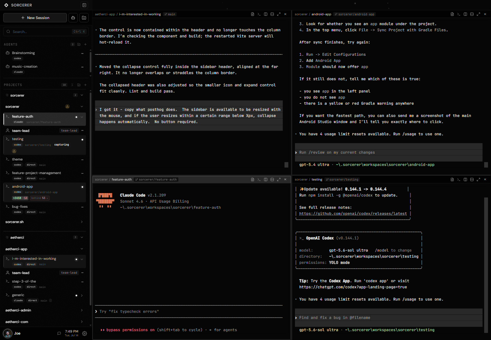

# Sorcerer

The desktop workbench for AI command-line coding tools. Not an IDE — a `mission control` for working with multiple coding agents.

## Download

Grab the latest release for your platform:

**[Download for Windows, macOS, and Linux](https://github.com/joe-scalise/sorcerer/releases/latest)**

**Android companion:** Sideloadable Sorcerer Remote APKs use independent
`android-v*` releases. See the [Android setup guide](docs/android.md).

Requires a supported AI CLI tool installed and available on `PATH`, such as [Claude Code](https://docs.anthropic.com/en/docs/claude-code), Gemini CLI, or Codex CLI.

> **Authentication note:** Sorcerer runs multiple concurrent agent sessions. Consumer subscription accounts (Claude.ai Pro, Gemini Advanced, etc.) are not designed for this usage pattern — you should authenticate each CLI tool with an **API key** from the respective provider.

> **Windows note:** The installer is not yet code-signed. SmartScreen may show "Windows protected your PC" — click **More info** → **Run anyway** to proceed. macOS users may need to right-click → Open on first launch.

## Features

- **Multi-session management** — Run multiple AI agent sessions side-by-side with persistent terminals
- **Project & worktree isolation** — Automatically create git worktrees so each session works in its own branch
- **Split view** — View and interact with multiple sessions simultaneously
- **Team awareness** — Monitor provider-specific integrations such as Claude Code teams and tasks
- **Standalone sessions** — Launch quick agent sessions without a project
- **Session recovery** — Resume previous sessions, detect orphaned worktrees, recover from crashes
- **Quick Notes** — Per-session scratchpad that persists across restarts
- **Remote access** — Built-in HTTP + WebSocket server with token auth for browser-based access
- **Android companion** — Pair a sideloaded, device-scoped remote-control app over a trusted LAN or VPN
- **Cross-platform** — Windows, macOS, and Linux

## Permissions

Sorcerer exposes a provider-agnostic unattended mode toggle. When enabled, it maps to the closest equivalent supported by the selected provider — for example Claude Code uses `--dangerously-skip-permissions`, Gemini CLI uses `--yolo`, and Codex CLI uses `--dangerously-bypass-approvals-and-sandbox`. This can be toggled per session and per agent. Review each provider's documentation before enabling it.

## Terms of Service & Licensing

Sorcerer is an independent orchestration workbench. It operates as a wrapper around existing CLI-based AI agents such as Claude Code, Gemini CLI, and Codex CLI.

- **Independent Tool**: Sorcerer is not affiliated with, endorsed by, or sponsored by Anthropic, Google, OpenAI, or any other AI service provider.
- **API Keys Required**: Sorcerer's multi-session model is designed for API key usage. Consumer subscription accounts are not compatible with concurrent session workflows. Users should authenticate each CLI tool with an API key from the respective provider.
- **No Circumvention**: Sorcerer does not bypass, modify, or multiplex user authentication or subscriptions. It relies entirely on the user's own local installation and valid authentication for these CLI tools.
- **Compliance**: Users are responsible for ensuring their use of underlying CLI tools through Sorcerer complies with the respective providers' Terms of Service. Sorcerer interacts with these tools via standard terminal interfaces (PTY) and does not modify their binary code or internal logic.

## How it works

Sorcerer wraps AI CLI sessions in native pseudo-terminals (`node-pty` + `xterm.js`), manages git worktrees for branch isolation, and integrates with provider-specific capabilities where available, such as Claude team data in `~/.claude/teams/`. All session data is stored locally in SQLite.

## Built with

Electron, React 19, TypeScript, electron-vite, xterm.js, node-pty, sql.js, Zustand, chokidar, simple-git

## Project Charter

Sorcerer is a mission control for AI-first development, as such it should not implement features that traditional IDEs already do well. Editors focus on typing code, Sorcerer focuses on helping users interact with coding agents in one place - handling concurrent sessions, git worktrees, and cross-project context.

## Contributing

Please help us make Sorcerer better. Please read our [Contributing Guidelines](CONTRIBUTING.md) to get started.

## License

[Apache-2.0](LICENSE) — Created by [Joe Scalise](https://scalise.us) and built and released with [AetherCI](https://aetherci.com).
